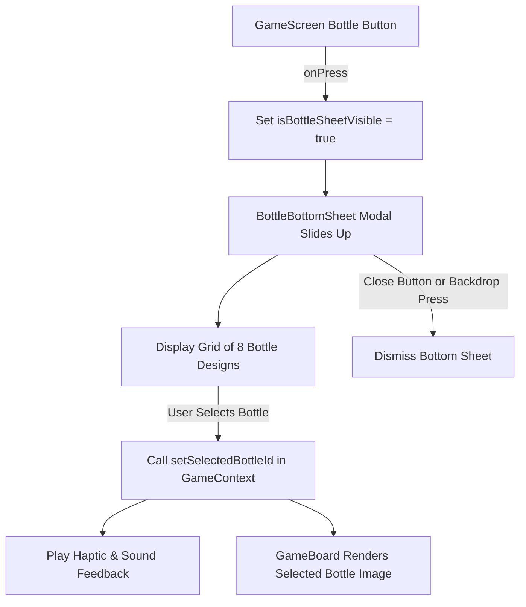

# Plan: Bottle Selection Bottom Sheet in GameScreen

## Goal
In `GameScreen`, when the user clicks on the bottle button (located at the bottom below the play button), open a modern, interactive **Bottom Sheet** displaying multiple bottle options. Selecting a bottle updates the active bottle on the `GameBoard` in real time.

---

## Proposed Architecture & Workflow

---

## Files to Create & Modify

1. **`src/data/bottles.ts`** *(New)*
   - Define catalog of 8 available bottles utilizing assets in `src/assets/images/`:
     - **Classic Vodka** (`vodka.png`) — `#7C5CFF`
     - **Absolut Blue** (`absolute_vodka.png`) — `#38BDF8`
     - **Black Noir** (`blackbottle.png`) — `#A855F7`
     - **Emerald Green** (`green_bottle.png`) — `#10B981`
     - **Martini Special** (`martin.png`) — `#EC4899`
     - **Squad Edition** (`squad_bottle.png`) — `#F59E0B`
     - **Crystal Clear** (`transparentbottle.png`) — `#6366F1`
     - **Royal Wine** (`wine_bottle.png`) — `#EF4444`

2. **`src/context/GameContext.tsx`** *(Modify)*
   - Add `selectedBottleId` state (default `'vodka'`).
   - Expose `selectedBottle` object and `setSelectedBottleId` method in `GameContextType`.

3. **`src/components/GameBoard.tsx`** *(Modify)*
   - Replace static `vodka.png` source with `selectedBottle.image` from `useGame()`.

4. **`src/components/BottleBottomSheet.tsx`** *(New)*
   - Slide-up bottom sheet modal using React Native `<Modal>`.
   - Semi-transparent backdrop + smooth sheet container with handle bar, header title, and close button.
   - 2-column responsive grid showing bottle preview images with glowing accent borders, bottle name, and active badge.

5. **`src/screens/GameScreen.tsx`** *(Modify)*
   - State `isBottleSheetVisible` (`useState(false)`).
   - Update bottle button `onPress` to trigger sound, haptic tap, and set `isBottleSheetVisible(true)`.
   - Render `<BottleBottomSheet visible={isBottleSheetVisible} onClose={() => setIsBottleSheetVisible(false)} />`.

6. **`src/i18n/locales/en.json`, `hi.json`, `gu.json`** *(Modify)*
   - Add localized keys for `bottles.title`, `bottles.subtitle`, and individual bottle names.

---

## Execution Steps

- [ ] **Step 1**: Create `src/data/bottles.ts` with all 8 bottle configs.
- [ ] **Step 2**: Update `src/context/GameContext.tsx` to handle bottle selection state.
- [ ] **Step 3**: Update `src/components/GameBoard.tsx` to display selected bottle dynamically.
- [ ] **Step 4**: Create `src/components/BottleBottomSheet.tsx` component.
- [ ] **Step 5**: Update `src/screens/GameScreen.tsx` to connect bottle button to bottom sheet.
- [ ] **Step 6**: Add translation strings in `en.json`, `hi.json`, and `gu.json`.
- [ ] **Step 7**: Verify build & TypeScript compilation.
